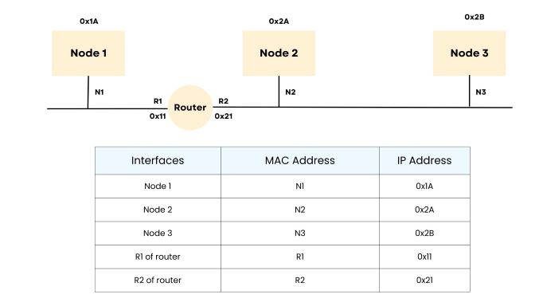
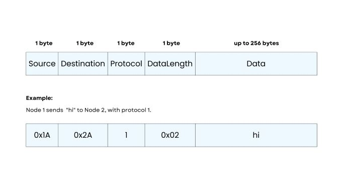
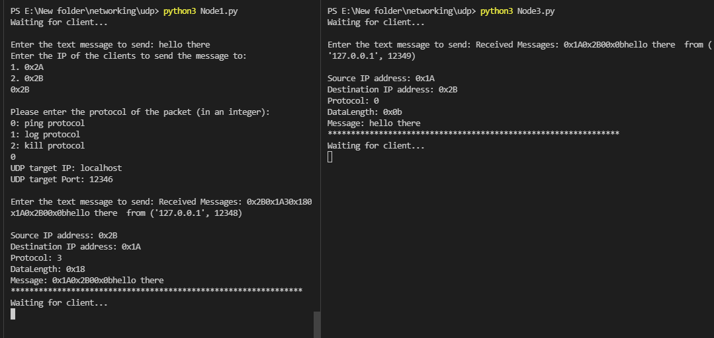
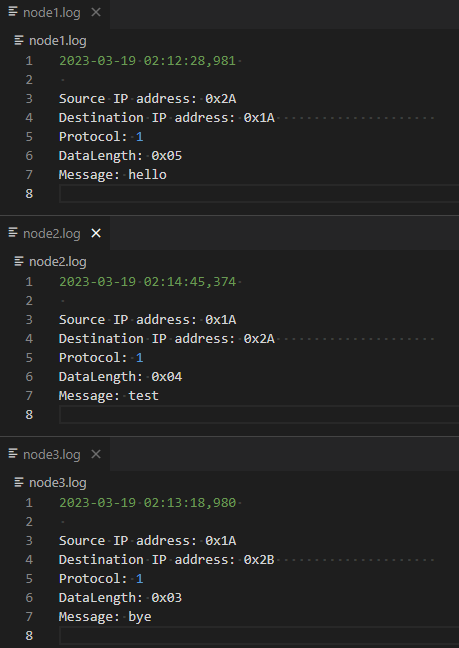
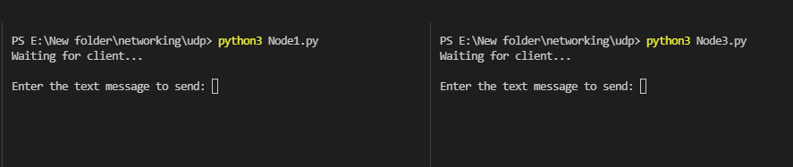
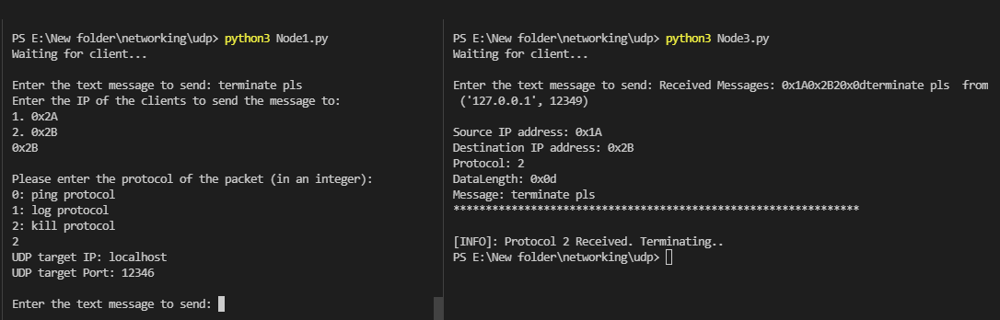

# Network Emulation

## About
Network Emulation is a project that aims to emulate behaviours in the Ethernet and network layer (IP), as shown in the diagram below.



The IP packets sent is in the following format:




## Getting Started

### Pre-requisites
1. - [Python](https://www.python.org/downloads/) (version 3)

### Usage

#### UDP Folder

Run (sequence of commands is not important since this is UDP):
```
1. python3 routerR1.py
2. python3 routerR2.py
3. python3 Node1.py
4. python3 Node2.py
5. python3 Node3.py
```

#### Implementation

1. Each Interface is binded to a port in localhost and has its own individual socket:
    - Node1: 12345
    - Node2: 12346
    - Node3: 12347
    - RouterR1: 12348
    - RouterR2: 12349

2. Protocol:
    - 0: ping
        - The recipient replies the sender with the same data
        - Example:
    

    - 1: log
        - The recipient writes the received data to a log file
        - We log the datetime and the IP packet details.
        - Example:  
            

    - 2: kill
        - The recipient exits & terminates its application (i.e. stops running)
        - Example:
            1. Node1 and Node3 are initially running
                
            2. Node1 sends Node3 an IP packet with the kill protocol
            3. Node3 is terminated
                

    - 3: indicator (reply from ping)
        - simply indicates that this packet is a reply from a ping sent out 
