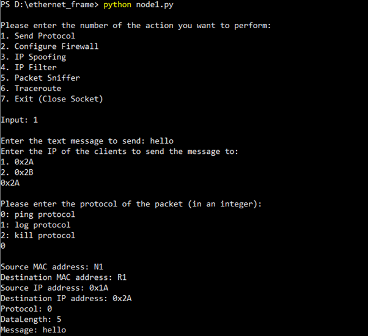
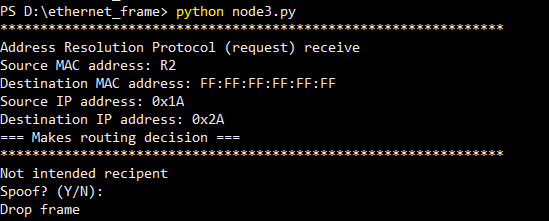
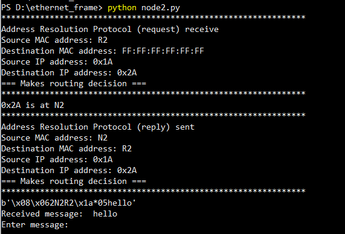
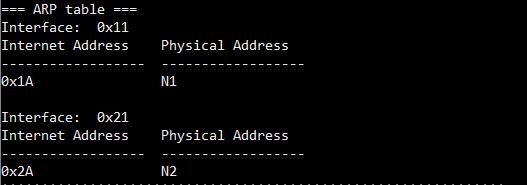
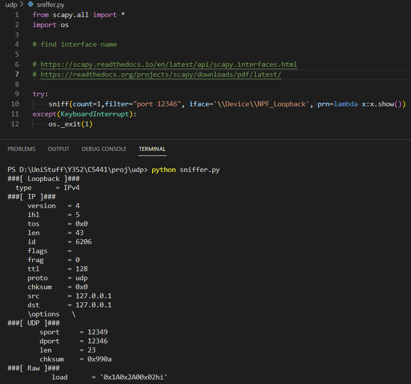
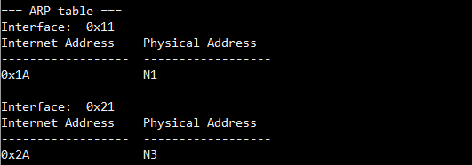
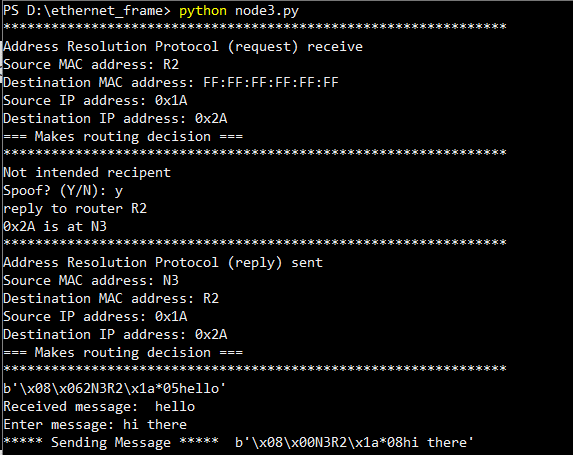

# Network Emulation

## Table of contents

- [Network Emulation](#network-emulation)
  - [Table of contents](#table-of-contents)
  - [About](#about)
  - [Getting Started](#getting-started)
    - [Prerequisites](#pre-requisites)
    - [Usage](#usage)
    - [Implementation of Ethernet Frames](#implementation-of-ethernet-frames)
    - [Implementation of IP Forwarding](#implementation-of-ip)
    - [3 Protocols](#2-protocol)
    - [IP Spoofing](#3-ip-spoofing)
    - [Sniffing Attack](#4-sniffing-attack)
    - [Firewall](#5-firewall)
    - [Open Protocol](#6-open-protocol)

 
## About
Network Emulation is a console app that aims to emulate behaviours in the Ethernet and network layer (IP), as shown in the diagram below.


The IP packets sent is in the following format:


## Getting Started

### Pre-requisites
1. - [Python](https://www.python.org/downloads/) (version 3.10 recommended)
    - pre-installed libraries:
        - socket
        - threading
        - logging
        - os
2. - [Scapy](https://scapy.readthedocs.io/en/latest/installation.html) (version 2.5.0 recommended)
    - for sniffing:
      - find out your loopback interface name.
      - Use the `show_interfaces()` command and `network_name()` commands
```
>>> show_interfaces()
INFO: Table cropped to fit the terminal (conf.auto_crop_tables==True)
Source   Index  Name                                      MAC                IPv4             IPv6
libpcap  1      Software Loopback Interface 1             00:00:00:00:00:00  127.0.0.1        ::1    


 >>> network_name('Software Loopback Interface 1')
'\\Device\\NPF_Loopback'
```

### Usage

#### UDP Folder
From root folder:
1. `cd udp` / open udp folder
2. Repeat step 1 for 5 terminals.


Run one command in each terminal (sequence of commands is not important since this is UDP):
1. `python3 routerR1.py`
2. `python3 routerR2.py`
3. `python3 Node1.py`
4. `python3 Node2.py`
5. `python3 Node3.py`

However, communication between Nodes requires the Router interfaces to be running.


#### Implementation of Ethernet Frames
- Address Resolution Protocol (ARP) Request-Reply
    - Example:  
        

- Ethernet Broadcast Effect Emulation
    - Example:  
        
        

- ARP Table
    - Example:  
        

#### Implementation of IP

#### 1. Each Interface is binded to a port in localhost and has its own individual socket:
- Port Numbers:
    - Node1: `12345`
    - Node2: `12346`
    - Node3: `12347`
    - RouterR1: `12348`
    - RouterR2: `12349`

- All IP Packets will go through the Router interfaces
    - packets will NOT be sent directly from one Node to another
    - e.g. 
        - Node 1 > R1 > R2 > Node 3
        - Node 2 > R2 > Node 3
        - Node 2 > R2 > R1 > Node 1


#### 2. Protocol:
- 0: ping
    - The recipient replies the sender with the same data
    - Example:


- 1: log
    - The recipient writes the received data to a log file
    - We log the datetime and the IP packet details.
    - Example:  
        

- 2: kill
    - The recipient exits & terminates its application (i.e. stops running)
    - Example:
        1. Node1 and Node3 are initially running
            
        2. Node1 sends Node3 an IP packet with the kill protocol
        3. Node3 is terminated
            

- 3: indicator (reply from ping)
    - simply indicates that this packet is a reply from a ping sent out 

#### 3. IP Spoofing:
- Node 3 is able to spoof Node 2's IP and send IP packets to Node 1
- command: `python3 Node3.py --spoof`
    - send a message to Node 1 with protocol 1 (ping) to see results
    - Node 2 will receive a ping reply even though it did not send out any ping packets


#### 4. Sniffing Attack
- `sniffer.py` runs using [Scapy](https://scapy.readthedocs.io/en/latest/installation.html)
    - run `python3 sniffer.py`
    - sniffs on Node2
    - future implementation: allow Node1 to sniff on Node2

        

#### 5. Firewall
- tbd

#### 6. Open Protocol
- ARP Poisoning
    - Example:
        - Node 1 is supposed to send a message to Node 2.
        - Node 3 is able to change the ARP table with its own MAC address
        
        - Node 3 can now receive the message from Node 1 even though it is not the intended recipent
        

- TraceRoute
